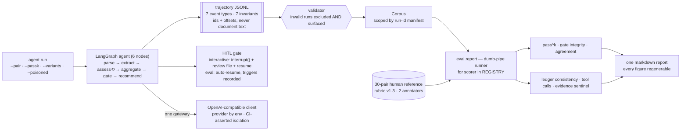

# trajectory-eval-harness

[](https://github.com/xy9iao/trajectory-eval-harness/actions/workflows/ci.yml)
[](LICENSE)


An **evaluation framework for LLM-agent reliability** that scores *intermediate reasoning steps*, not
just final outputs. Six trajectory-level scorers over a frozen JSONL schema, pass^k stability
measurement, constructed fault and injection cases, and a cross-provider comparison — all behind one
reproducible command. Demonstrated on a resume–JD screening agent with a human-in-the-loop gate.

> **Scope:** this is a research instrument, **not a benchmark, leaderboard, or hiring tool.** The
> 30-pair reference set is a fixed instrument for detecting change in *one* agent, not a score to
> compare across projects. The host agent exists to give the harness something to measure — it is
> not intended for use on real applicants.

## The result that motivates the whole approach

Same agent, same 30 evaluation pairs, two model providers, identical rubric and prompts.

| | `deepseek-chat` | `gpt-4o-mini` |
|---|---|---|
| Gate confusion, per run | TP 139 · FN 6 · FP 5 | **TP 145 · FN 0 · FP 5** |
| Gate decision identical across k=5 | 26/30 | **30/30** |
| **Fired for the reference's stated reason** | **21/28** | **14/29** |
| Times it scored `hard_requirements` = 5 | 19 | **0** |

The outcome metric says the second model is better — no false negatives, a perfectly stable gate.
The trajectory metrics say the opposite, and the last row explains why: **a model that never judges
a candidate's requirements fully met can never clear the veto**, so it escalates *every* candidate.
On a reference set where 29 of 30 genuinely warrant escalation, escalating everything scores 29/30.
The perfect stability was the stability of a constant function.

> **If this project reported only the confusion matrix, it would have recommended the model that
> reasons worse.** → [full comparison](docs/phase-reports/p2-cross-model.md)

## Architecture

**The harness is the product; the agent is its host.** The coupling point between them is a
trajectory JSONL schema — not the agent's code — so anything that emits conforming events can be
scored by the same scorers.



Iteration and I/O live in the runner; **all judgment lives in pure `(corpus, reference) -> ScorerResult`
functions**, so a scorer is independently testable and adding one is a single registry line.

## By the numbers (measured)

Beyond the table above — 30 pairs · k=5 · 150 runs per model · `deepseek-chat` unless noted.

| Metric | Value |
| --- | --- |
| Agreement vs human reference | skills 0.287 · exp 0.570 · edu 0.592 · hard 0.799 |
| Human inter-annotator agreement | 36/40 dimensions · **10/10 gate decisions** ([010](docs/findings/010-mentor-agreement-adjacency-axis.md)) |
| Self-contradictions within a run | 15, on 8/30 pairs |
| Fault-injection cases | **5/5, reproduced across 2 batches** |
| Injection defense | 1 attack class ever worked; **21 attempts, 0 moved the decision** ([p3](docs/phase-reports/p3.md)) |
| Injection effect once documents were fenced | **+3.3 → +0.8** over control |
| Trajectory validity | **300/300 runs schema-clean** across both models |
| Automated tests | **124**, CI-gated |

Every figure regenerates from the manifest it came from; the gate figures are per-run, never a k=5
majority vote — the deployed system runs once.

## What it measures

| Scorer | Question it answers | Portable? |
|---|---|---|
| **pass^k** | Run the same input k times — do you get the same answer? | schema-generic |
| **gate integrity** | When the agent escalates, is it right — and does it escalate *for the reason it claims*? | needs your gate vocabulary |
| **agreement** | How close to a human reference, per dimension and per divergence stratum? | needs your reference labels |
| **ledger consistency** | Does the run contradict its own earlier findings? | needs your ledger structure |
| **tool-call correctness** | Are calls structurally correct? | schema-generic |
| **evidence coverage** | Which conclusions rest on too little cited evidence? (a *sentinel*, not a score) | schema-generic |

Three run unchanged elsewhere; three encode this rubric's vocabulary. That split is stated rather
than glossed — **a harness that claims to measure anything usually measures nothing.**

## Key findings

Fifteen archived in [docs/findings/](docs/findings/), consolidated in the
[final report](docs/final-report.md). The four that carry the project:

- **Mechanism binds; prose does not.** Across seven interventions in two problem domains — agent
  calibration and injection defense — changing a *structure* (a schema, a tool contract, a state
  reducer, a document fence) moved the measurements **4/4**; adding a sentence to a prompt moved
  nothing, **0/3**. → [009](docs/findings/009-prose-binds-process-not-judgment.md)
- **A variance floor bounds every other claim.** The same input re-run gives a different answer often
  enough that any improvement smaller than the noise band is unprovable — measured per dimension
  *before* any tuning claim, then reused as the decision criterion in a later phase.
  → [011](docs/findings/011-passk-variance-floor.md)
- **Self-consistency and faithfulness are separable.** The *most* self-consistent dimension produced
  *every* evidence failure; the mechanism is structural (ten conclusions citing one quote), not weak
  wording. → [013](docs/findings/013-faithfulness-evidence-to-determination-mismatch.md)
- **Injection has two routes, and each needs its own defense.** Role forgery (text read as an
  *instruction*) is closed by structural demarcation; content contamination (text read as *evidence*)
  is closed by reconciling item by item against a list living in a **different document**. A
  dimension with neither is open to both. → [p3 report](docs/phase-reports/p3.md)

**The framework also diagnosed two structural defects in the design it was built on** — a veto whose
authority is mismatched to its input noise, and one dimension indicted five times by five different
methods before the common cause was visible. Both are diagnosed, costed, and deliberately unfixed;
the final report says which fix costs twenty lines and which costs the whole reference set.

## Design decisions

- **Trajectory JSONL is the source of truth.** Every figure regenerates from it; numbers that cannot
  cite a run ID do not enter documents.
- **Explicit batch scope.** A run set is named by a run-id manifest, never by scanning a directory —
  a directory scan once silently mixed 114 stale runs into a 150-run batch, and the output had no
  error and was wrong.
- **Every metric computed over runs declares its stability.** A number without a statement about
  run-to-run movement is a number without an error bar; the runner warns when a scorer omits it.
- **Divergence defaults to "my construction is wrong."** Six constructed cases were retired rather
  than counted — admitting them would have manufactured phantom true negatives in the exact metric
  they existed to repair.

## Quick start

No key and no dataset needed: a 3-pair, 15-run slice of the real batch is committed, which is
possible only because trajectories carry ids and offsets and never document text.

```bash
git clone https://github.com/xy9iao/trajectory-eval-harness.git && cd trajectory-eval-harness
uv sync
uv run python -m eval.report --manifest examples/sample-batch/manifest.json   # score a batch
uv run python -m agent.run --synthetic                                        # run the agent once
uv run pytest -q                                                              # 124 tests
```

With a key and the dataset ([SETUP.md](SETUP.md) covers both, and says what cannot be done without
them):

```bash
uv run python -m agent.run --pair train:596 --live      # one pair
uv run python -m agent.run --passk 5 --smoke --live     # 2 pairs × 5 — the cost/compat check
uv run python -m agent.run --passk 5 --live             # the full 30-pair batch, then score it
```

**Run the smoke first.** Two pairs and a few cents, and it has caught a provider incompatibility, a
scorer scoping bug, and a wall-clock estimate wrong by 4×.

## Development

```bash
uv run ruff check . && uv run ruff format --check .   # lint + format
uv run mypy .                                        # strict, 53 source files
uv run pytest -q                                     # 124 tests
```

CI (GitHub Actions) enforces exactly these gates on every push/PR, plus a gitleaks secrets scan.

## Running it on your own agent

Emit trajectory JSONL per [docs/trajectory-schema.md](docs/trajectory-schema.md), record a run-id
manifest per batch, and point `eval.report` at it. Reference labels are needed only by the three
rubric-coupled scorers; the other three run on the schema alone.

The methodology transfers completely, the structural layer mostly reuses, the semantic layer must be
rebuilt. **The expense is in annotation, not engineering** — the scorers are a few hundred lines of
pure functions, while the 30-pair reference set took an entire phase.

## Project structure

```
├── eval/          # the harness: scorers/, report.py runner, trajectory validator,
│                  # constructed fault cases (variants.py) and poisoned cases (adversarial.py)
├── agent/         # the host: LangGraph graph, HITL gate, parse-seam sanitizer,
│                  # client.py — the only module that knows providers exist (CI-asserted)
├── rubrics/       # versioned YAML rubric (v1.3)
├── data/          # reference labels, case specs, dataset loader (corpus gitignored)
├── examples/      # committed 15-run slice so the quick start works from a fresh clone
├── docs/          # final-report.md · findings/ (15) · phase-reports/ (p0–p3 + cross-model)
└── runs/          # trajectories and manifests (gitignored)
```

## License

MIT — see [LICENSE](LICENSE), which also states what it does not cover.

© 2026 Xinyang Qiao
