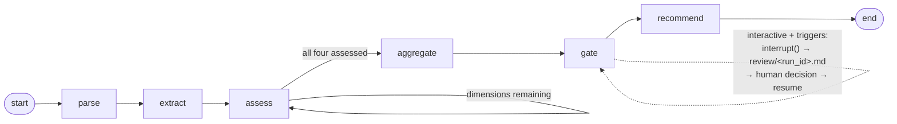

# Phase Report — P1: Agent + HITL gate

> **STATUS: CC-generated, owner double-checks (research protocol §9.2).** Every number cites
> its regenerable source: a script in `eval/reports/`, a run ID under local `runs/`, or a CI
> test. Design decisions live in [p1-design.md](../p1-design.md) (seven owner-ratified
> decisions + one recorded supersede); this report presents outcomes.
> P1 ran under a recorded overlap with P0 (decisions.md, 2026-07-17): P0's closure waits only
> on the mentor touchpoint and completes separately with full ritual.

## 1. Architecture

Sequential assess loop (decision 1): one `assess` node runs once per dimension via a
conditional edge, **hard_requirements last** (its ledger reuses the other dimensions'
determinations). Parallel fan-out was rejected because nondeterministic event ordering
pollutes trajectory replay and pass^k comparison; a single mega-call was rejected because it
destroys per-dimension trajectory granularity — the eval's protagonist. Scheduling is
graph-owned; the model owns non-enumerable judgment, submitted through schema-enforced
function calls (decision 3: tool calling as the output contract's enforcement mechanism —
`evidence_quotes` is `required` at the API level, not requested at the prompt level).

State (decision 2): TypedDict, documents by value (hermetic interrupts; pass^k internal
validity), assessments under a strict merge reducer — duplicate writes raise (the carve-out
designed for retries was deleted at implementation: retries live inside `assess_dimension`
and never surface as state writes; the contract TIGHTENED from design to implementation).
Trajectory events are logger-side, never state: a crashed run keeps its evidence.

## 2. Trajectory schema (frozen-candidate v0.2)

[trajectory-schema.md](../trajectory-schema.md): seven event types, seven validator-enforced
invariants — each the seed of a P2 structural scorer (dimension completeness · evidence
citation · gate consistency incl. degraded ⇒ `insufficient_evidence` · totals reconciliation
· retry visibility · data hygiene). Validator + one planted defect per invariant:
`eval/trajectory.py`, `tests/test_trajectory_schema.py` (the P2 "a scorer that can't catch a
planted defect is not done" rule, applied from day one). The version P2's first scorer commit
reads is frozen. **Acceptance: schema frozen-candidate committed ✓.**

Invariant 7 (no dataset text in any event, ≥20-char substring test) earned its keep in
production: it fired 10× on the first live run and drove the carrier contract (finding 007).
Every batch since: **hygiene clean 30/30, three consecutive batches.**

## 3. Gate design

Two modes (D15), both exercised end to end:

- **eval:** triggers recorded as `gate_event{action: auto_resume, resolution: auto}`; batch
  runs never block. Three full 30-pair batches ran this mode (2026-07-20/21).
- **interactive:** dynamic `interrupt()` inside the gate node — "stop only when there is
  something to review" is the gate's own semantics. On interrupt the reviewer gets
  `review/<run_id>.md` (evidence text is legal there and nowhere else) with **raw and capped
  aggregates side by side** — the cap constrains the machine's conclusion, not the human's
  information. `gate_event` is emitted only after the interrupt returns (no resolution
  exists until then); the review file is idempotent-by-existence because the gate node
  re-executes on resume. Human adjudication lands in the trajectory
  (`resolution: approved|edited|rejected`) — reviewer behavior is itself evaluable data.

Trigger settings and their four-step rationale (gate thresholds are not guesses):

| setting | value | rationale chain |
|---|---|---|
| boundary band | [2.5, 3.5) | rubric passing floor 3 → half-band tolerance → alignment check vs the 30 reference labels (8 in-band, 7 hand-flagged boundary) → P2 numeric revision loop. One ruler, three places: gate trigger ≡ divergence operationalization ≡ P2 revision baseline |
| advance | capped ≥ 3.5, veto met, not partial | ditto |
| veto cap | 2.4 | one tick below the boundary floor: a veto-unmet pair can never present as boundary-or-better; trajectory records raw AND capped |
| anomaly | CLOSED list: empty doc · <200 chars · load/decode failure | deterministic, zero-judgment (5b); heuristics and injection belong to P3 — the layering is deliberate |
| hard_unmet / hard_indeterminate | soft-veto wiring | rubric aggregation contract; degraded ledger ⇒ indeterminate (the ledger could not be read) |

Design input on record: the reference set's gate ground truth is 29/30 positive (finding
004). No threshold gymnastics manufacture negatives; the negative class comes from P2's
controlled variants. Final gate confusion on the v1.3 batch: **TP 28 · FN 1 · FP 1 · TN 0**
(`eval/reports/batch_vs_reference.py`) — the TN=0 degeneracy is observed, not hidden.

## 4. Three annotated trajectories

**4a. First live run — train 596, `r20260720T094231-3ae875`** (DeepSeek, 23,502 in / 2,051
out tokens, 17.6 s, zero retries). Structural validation CLEAN; three catches in one file:
(1) hygiene invariant fired 10× — model-authored determination labels quoted the JD →
carrier contract (finding 007); (2) per-dimension scores matched the owner's reference
labels EXACTLY on all three scoring dimensions and the aggregate (1.4 ≡ 1.4) — and still
produced a gate miss: `hard_requirements` read "14 years of IT (QA)" as satisfying
"relevant" years while its own `experience_level` notes acknowledged the QA↔DataEng
mismatch — an intra-run contradiction, detectable with zero annotation (finding 008, the
third scorer class); (3) the miss survived two rubric-prose rounds (finding 009).

**4b. The degraded escalation chain (decision 3-ii), synthetic** — reproducible as
`tests/test_llm_nodes.py::test_e2e_degraded_dimension_full_3ii_chain` (scripted completer;
no run ID because CI runs carry no dataset): one dimension malformed twice → `degraded,
score null` → `aggregate{weighted_mean: null, partial: true}` → `gate_event` with
`insufficient_evidence` → recommendation `flagged`; trajectory passes all invariants.
Model output violations are never silently repaired or dropped — they degrade and escalate
to a human.

**4c. Interactive gate, owner-driven — train 596, `r20260721T031458-26e0fd`** (live). Run
paused at the gate (`boundary` trigger), reviewer read the evidence file, set
`decision: approve`, resumed via CLI. Trajectory: CLEAN, seq 0→21 unbroken across the
suspension, `gate_event{action: interrupt, resolution: approved}`, run_end present. The
hands-on run also surfaced a forward-compat defect (unregistered pydantic types in
checkpoints would be BLOCKED by future langgraph) — fixed with an explicit serde allow-list
the same session.

## 5. Compatibility layer (D3's three requirements)

① Provider specifics in ONE module — `agent/client.py`; **enforced by CI**
(`tests/test_provider_isolation.py`: any provider string elsewhere in agent/ or eval/ fails
the build). ② Schema validation + one corrective retry + visible degradation —
`call_with_validation` (+ `post_validate` for semantic checks: quote resolution, ledger
score constraints, label hygiene). ③ provider/model/tokens/latency on every `llm_call`.

Malformed-output matrix (mocked transport, zero live calls/keys in CI, identical chain under
both provider configs — `tests/test_compat_layer.py`, 78-test suite green):

| case | deepseek config | openai config |
|---|---|---|
| valid first try | ok | ok |
| malformed → corrective retry → valid | ok (statuses malformed_output, ok) | ok |
| malformed ×2 | degraded, metadata intact | degraded, metadata intact |
| transport error ×2 | degraded (status error) | — (provider-independent path) |
| corrective messages | field paths only, never payload values (leak-guard test) | same |

**Acceptance: compat layer passes its three requirements ✓** (①/② by CI assertion, ③ by
schema invariant 5 + every batch trajectory).

## 6. Calibration record (two rounds, attribution-disciplined)

Full tables in [p1-design.md](../p1-design.md); the shape of the record:

- **Round 1** (2 prompt debts + 1 rubric debt; independent metrics): ledger contradictions
  **8 → 2** (stable at 2 across both later batches) · degradations **5 → 1** (education
  4 → 0; resolution_failures 178 → 107) · rubric v1.2 "relevant = role-matching": **target
  unmoved — recorded honestly**.
- **Round 2** (rubric-only, per the one-attributable-change rule): v1.3 worked negative
  example + band-0 discriminant: **both targets unmoved.** Diagnosis before the round
  (justifications read from state): the definition was read and overridden — the model's
  surface prior ("14 years … clearly meets") wins at application time.
- **Stop ruling (owner):** across five interventions, mechanisms held (3/3) and semantic
  prose failed (2/2) — finding 009. Semantic targets reclassified as model-limitation;
  P2 reports agreement stratified by divergence root cause. A research harness makes
  failure visible rather than making it disappear; 596 is preserved as the exhibit.
- **Cost ledger (dev, deepseek-chat):** round 1 742,420 in / 95,970 out · round 2 (fewer
  retries after the #2 fixes, −26%) 549,120 / 67,989 · round 3 560,684 / 71,327. A full
  30-pair eval round costs ≈0.55–0.75 M input tokens — measured, not estimated.

Final v1.3-batch agreement vs reference (exact-match, non-degraded;
`batch_vs_reference.py`): skills 9/30 · experience 18/29 · education 17/29 · hard 24/30.
Reported un-averaged and un-spun; the P2 chapter carries the stratification.

## 7. P1 findings index

- [007](../findings/007-hygiene-invariant-first-live-catch.md) — **closed**: hygiene
  invariant's first live catch → symmetric carrier contract → id-based labels; 3 batches
  clean. - [008](../findings/008-ledger-consistency-scorer-from-first-failure.md) — **open
  (P2)**: internal-coherence scorer class donated by the first gate miss; verified at 8/7
  pairs, baseline banked; consistency ≠ correctness caveat on record.
- [009](../findings/009-prose-binds-process-not-judgment.md) — **closed at P1 scope**:
  mechanism 3/3 vs semantic prose 0/2; working hypothesis pending the cross-model table.
- [004](../findings/004-gate-truth-imbalance.md) — progressed: TN=0 observed in vivo;
  Change (variant plan) lands in P2.

## 8. Acceptance walk

- [x] **Schema frozen-candidate committed** — v0.2, validator + planted-defect tests (§2)
- [x] **Graph runs end-to-end in both modes on example pairs** — eval: three 30-pair
  batches, 30/30 valid each; interactive: owner-driven live run `r20260721T031458-26e0fd`
  (§4c)
- [x] **Compatibility layer passes its three requirements** — §5, CI-enforced
- [x] **p1 report complete with graph diagram and annotated trajectory samples** — this
  document (§1, §4)

## 9. Handoff to P2

Schema v0.2 freezes at P2's first scorer commit. Pre-committed P2 items (p1-design.md):
agreement stratified by divergence root cause · ledger-consistency scorer (008; this
phase's batches are its known-positive test set) · gate trigger-attribution correctness ·
pass^k follow-up on skills variance (13→7→9 across single-run batches) · negative-class
variants (004). The 30-pair reference set, three full batch snapshots, and the cost ledger
are the seed material. P0's mentor touchpoint remains open and gates only P0's own closure.
